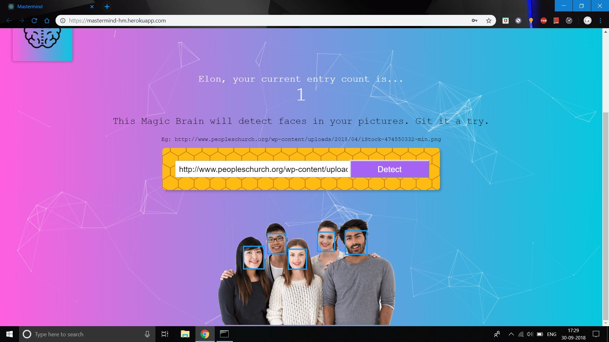
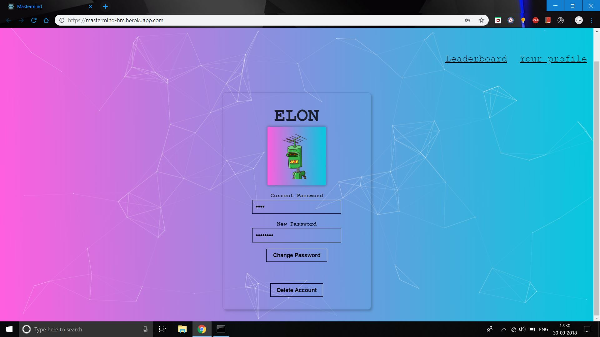
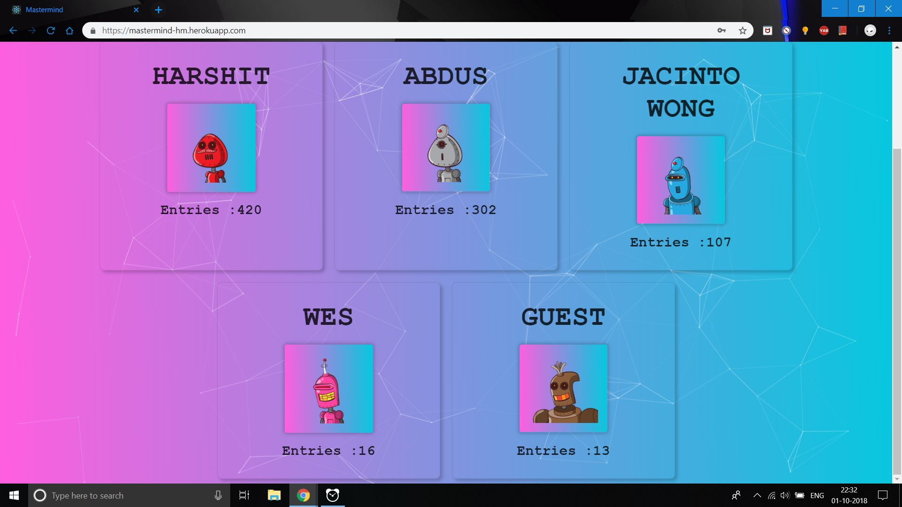

# Mastermind

> This is a web application which uses machine learning to detect faces in your images with provisions for registering, signing in, viewing the leaderboard , changing your password and even deleting your account !! 

> It is built using React (for building user interfaces) and Express ( web framework for Node.js ) .

> This repository hosts the code for the frontend part. Code for the server built using expess can be found at https://github.com/hmahajan99/Mastermind-api.

> Deployed at https://mastermind-hm.herokuapp.com/

### Libraries used :
<ul>
<li>react</li>
<li>react-particles-js</li>
<li>react-tilt</li>
<li>tachyons</li>
<li>express</li>
<li>clarifai</li>
<li>bcrypt-nodejs</li>
<li>knex</li>
</ul>

## This app implements the following functionalities :
<ul>
<li><b>Face Detection :</b> Enter an image url and the faces will be highligted.</li>
<li><b>Authentication :</b> Users can register, sign in , view their profile, change passwords and even delete their account. A unique user icon is generated for each user. There is also a facility for a guest user (whose password cannot be changed and account cannot be deleted). </li>
<li><b>Security :</b> Users passwords are stored securely as hashes in the database using bcrypt. Also all sensitive information(api key, database url) are accesed through environment variables. Communications between frontend and backend are secure against man-in-the-middle attacks due to bidirectional encryption using HTTPS protocol. Also measures for proper error handling have been taken.</li>
<li><b>Routing :</b> Routing is implemented from scratch in React without the use of any third party libraries.</li>
<li><b>Database :</b> A relational database system has been used to store all the information with a well defined schema implemented using PostgreSQL and Knex.js .</li>
</ul>

To run this project :
1. Clone this repo
2. Change you directory : `cd Mastermind`
3. Run `npm install`
4. Run `npm start`

#### Face Detection :

#### User Profile :

#### Leaderboard :

